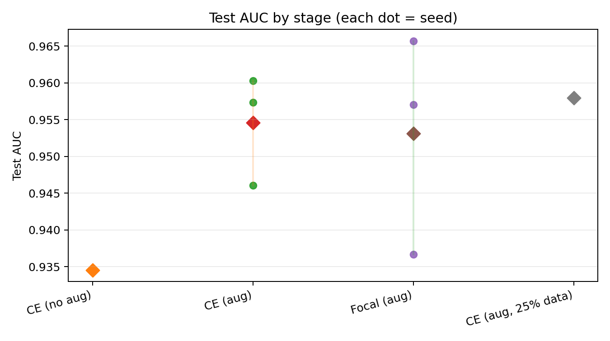
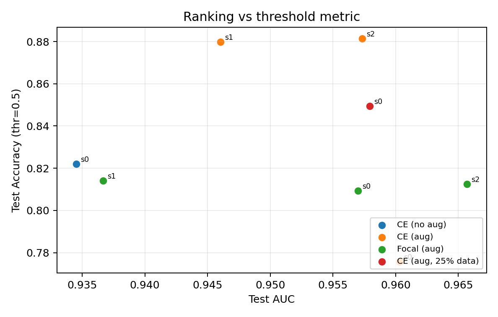
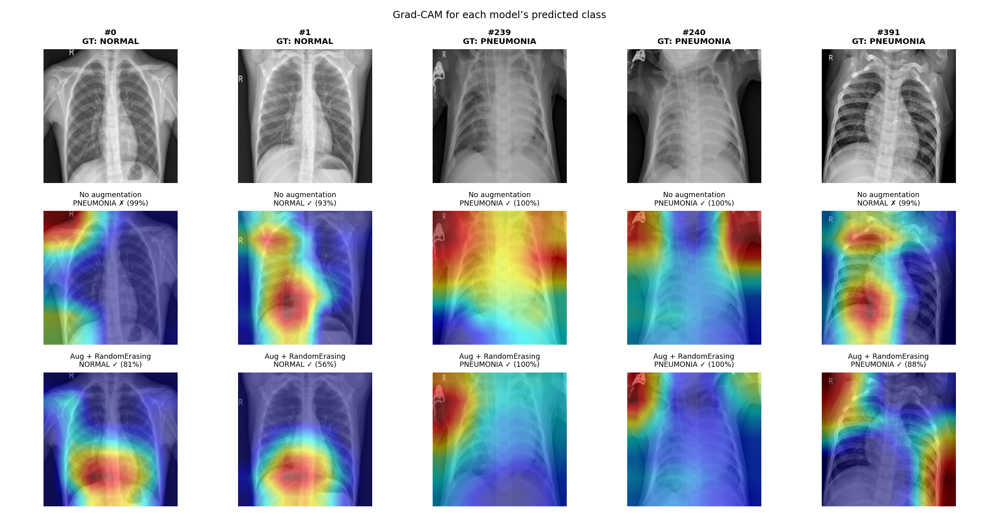

## Chest X-Ray Pneumonia Screening

**MEDIMG FS26** — Decision Support in Medical Imaging  
Marvin Huber · Alex Libov · Joel Greiner

Binary triage: **NORMAL vs PNEUMONIA** · Reproducible repo on GitHub

---

## Motivation

- **Clinical need:** prioritize likely pneumonia cases in busy workflows
- **Our role:** decision **support** — not autonomous diagnosis
- **Success criteria:** ranking quality (AUC) + transparent error types (FP/FN) at a stated threshold

---

## Dataset & Protocol

| Item | Choice |
|------|--------|
| Data | `hf-vision/chest-xray-pneumonia` (CC BY 4.0) |
| Train | ~5.2k (HF train) |
| Validation | **10% stratified hold-out from train** (HF val ≈16 → too small) |
| Test | **624** HF test images — **never used for training** |
| Input | 224×224 RGB, ImageNet normalization |

---

## Dataset (quick snapshot)

- **Task labels:** NORMAL vs PNEUMONIA
- **Test set label count:** 234 NORMAL · 390 PNEUMONIA
- **Why this dataset:** small, public, easy to reproduce end-to-end; good for studying baselines + ablations
- **Caveat:** single dataset → limited external validity (no hospital/site shift tested)

---

## Evaluation

- **ROC-AUC** — threshold-free ranking
- **Accuracy & F1** — at fixed threshold **0.5** (not tuned for deployment)
- **Confusion matrix** — false positives on normals vs false negatives on pneumonia
- **Robustness:** seeds 0–2 for main models; ablations: aug, loss, 25% train data

---

## Baselines (test set)

| Method | AUC | Acc | F1 |
|--------|-----|-----|-----|
| Random (train prevalence) | 0.52 | 0.58 | 0.69 |
| Majority class | 0.50 | 0.63 | 0.77 |
| **Frozen ResNet18 + logistic regression** | **0.95** | **0.84** | **0.89** |

**Takeaway:** strong pretrained features already solve most of the task.

---

## Model 1 — ResNet18 + cross-entropy

- ImageNet **ResNet18**, fully fine-tuned
- Loss: **cross-entropy**
- Main variant: **augmentation on** (flip, rotation, color jitter, **RandomErasing**)

---

## Model 2 — ResNet18 + focal loss

- Same **ResNet18** backbone (fine-tuned)
- **Focal loss** (γ = 2) instead of CE — focus on hard examples
- Trained with augmentation on (same protocol as Model 1 aug)

---

## Results — fine-tuned vs baseline (test AUC)

| Model | AUC (seed 0) | AUC (seeds 0–2 mean) |
|--------|--------------|----------------------|
| Frozen ResNet18 + LR | 0.949 | — |
| CE, **no aug** | 0.935 | — |
| CE, **aug on** | 0.960 | **0.954** |
| Focal, **aug on** | 0.957 | **0.953** |

**Interpretation:** gains over frozen LR are **small (~0.01–0.02 AUC)** — useful but not dramatic.

---

## Results — threshold 0.5 matters (234 normals on test)

**False positives** = normal scans called pneumonia (cm₀₁ / 234):

| Run | FP count | Rate on normals |
|-----|--------|-----------------|
| Frozen LR | 94 | 40% |
| CE, no aug | 108 | 46% |
| CE, aug (seed 0) | **140** | **60%** |
| CE, aug (seed 1) | 72 | 31% |
| CE, aug (seed 2) | 70 | 30% |

**Interpretation:** higher AUC does **not** always mean fewer FPs at 0.5; aug changed **score calibration**, not a clear win on all metrics.

---

## Ablations (seed 0, test)

| Ablation | AUC | Acc | F1 |
|----------|-----|-----|-----|
| Aug **off** (CE) | 0.935 | 0.82 | 0.87 |
| Aug **on** (CE) | 0.960 | 0.78 | 0.85 |
| Focal vs CE (aug on) | 0.957 vs 0.960 | ~0.81 vs ~0.78 | ~0.87 vs ~0.85 |
| **25% train data** (CE, aug) | 0.958 | 0.85 | 0.89 |

25% run: **single seed** — illustrative only, not a strong claim.

---

## Summary plot — AUC across stages (seeds)

- AUC is **high** across runs; differences are **incremental**.
- CE-aug and focal-aug show **moderate** seed-to-seed variance.



---

## Summary plot — AUC vs accuracy (thr=0.5)

- AUC measures **ranking**, accuracy depends on the **threshold**.
- Explains why some runs look “worse” at 0.5 even with strong AUC.



---

## Qualitative analysis (Grad-CAM)

**Goal:** inspect *where* models look (explainability), not prove augmentation “fixes” attention.

**Protocol:**
- Fixed test indices → `configs/gradcam_manifest.json` (TP / TN / FP / FN examples)
- Grad-CAM targets **each model’s predicted class**
- Compare **aug off vs aug on** (same images): `results/gradcam/aug_off_vs_on.png`

---

## Qualitative — Grad-CAM (aug off vs on)



---

## Qualitative — what we observed

- Maps often highlight **lung fields and borders** — not always a focal consolidation
- **Aug off vs aug on:** on several cases, CAM looks **more central / anatomical** (less “random” edge focus)
- **Quantitative** changes (AUC, FP rate at 0.5) were **larger than visual** differences
- **Honest conclusion:** saliency is **illustrative**; needs external validation + better methods for clinical trust

---

## Limitations & ethics

- Single public dataset · risk of **shortcuts** (view, edges, equipment)
- **No threshold tuning** on validation for clinical operating points
- **No external site** validation · high AUC ≠ safe deployment
- **Automation bias** if users over-trust scores
- **False negatives** remain clinically critical — report FN counts, not only AUC

---

## Reproducibility

```bash
bash scripts/setup.sh && source .venv/bin/activate
bash scripts/reproduce.sh all
SEEDS="0 1 2" bash scripts/reproduce.sh robustness
```

Artifacts: `results/test_summary.csv`, per-run plots under `results/<stage>/seed_*/`, checkpoints in `checkpoints/`

---

## Conclusion

1. Task is **feasible**; frozen ImageNet features are already strong (**AUC ≈ 0.95**).
2. Fine-tuning + aug gives **incremental** ranking gains; **not** a large leap.
3. **Focal loss** did not clearly beat CE in our runs.
4. **Qualitative Grad-CAM** shows **mixed** behavior — several cases look **more central/anatomical** with augmentation, but this is not a replacement for quantitative evaluation.
5. **Future work:** threshold tuning, external validation, richer pathology labels (e.g. multi-label CXR).

---

## Thank you

Questions?

<span style="font-size: 18px">Repo: <code>MEDIMG-FS26-Pneumonia-Detection</code></span>
